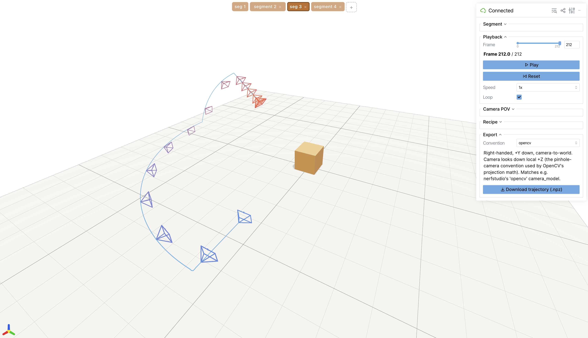
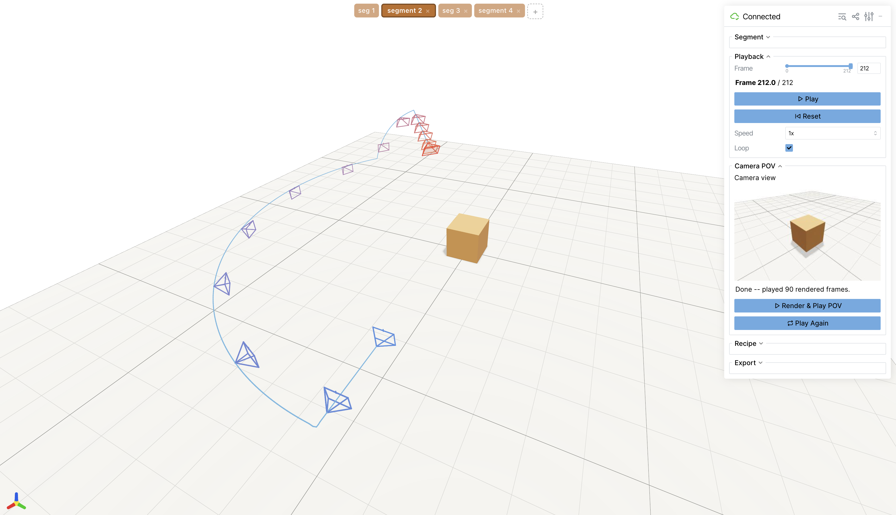
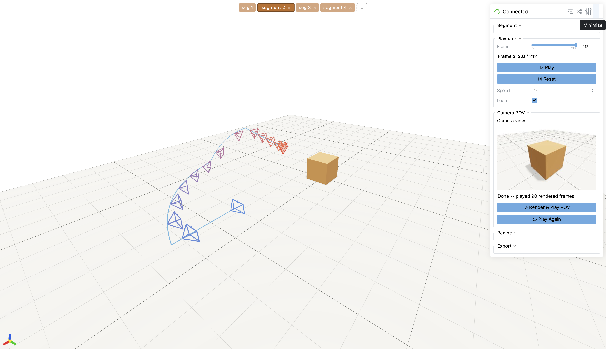

<p align="center">
  <h1 align="center">CamTraj</h1>
  <p align="center">
    <strong>Generate and visualize camera trajectories</strong>
    <br>
    one handcrafted shot at a time, or thousands under controlled randomness
  </p>
</p>

<p align="center">
  
  
  
</p>

---

## To-do


[] SOMA visualizations and <a href="https://cyberiada.github.io/Auteur/">Auteur DSL</a><br>
[ ] API generation<br>
[x] Batched generation with randomized structure (which/how many segments)<br>
[x] Batched generation with given constraints<br>
[x] Visualise camera POV<br>
[x] Generate and visualise fine-grained camera trajectory


## What is this?

A toolkit for authoring camera (and scene-object) motion: pick a motion
primitive, shape it with a handful of continuous sliders, and get a clean,
exportable 3D trajectory — one carefully handcrafted shot, or a large batch
of independent variations sampled under ranges *you* control.

It reimplements the trajectory-generation logic behind
[**LAMP**](https://cyberiada.github.io/LAMP/)'s language-driven motion DSL
for direct, LLM-free human use — continuous sliders instead of categorical
tiers, purpose-built interactive apps instead of a script.

## Use cases

- 🎬 **Video & image generation** — controllable camera-motion signals for
  training and conditioning camera-aware video/diffusion models, in bulk,
  with known ground truth.
- 🤖 **Robotics** — trajectories with precisely controlled shape and speed for
  camera-in-hand motion planning, visual servoing, active perception.
- 🛸 **Drones & aerial cinematography** — block out flight paths, or generate
  randomized batches for simulation and sim-to-real transfer.
- 🧭 **SLAM / SfM / NeRF benchmarking** — reconstruction pipelines evaluated
  against trajectories with known, exportable ground-truth poses.
- 🎥 **Virtual production, previz & game cinematics** — block camera moves
  before committing to a physical shoot or a hand-authored in-engine path.
- 🕶️ **Embodied AI & simulation** — synthetic ego-motion camera paths for
  training and evaluating perception models at scale.

## Features

- **Continuous, not categorical.** Sliders throughout, with the original
  DSL's discrete tiers kept as reference tick marks.
- **Three apps, one shared engine** — see below.
- **A scene anchor that can move.** Every trajectory is built around "the
  box," which orbits/tracks/chases can target, and which can itself
  translate over time, independently of the camera.
- **Save, load, export.** Recipes (the editable segment design) save/load as
  JSON; finished trajectories export as `.npz` (camera + object, separately)
  in your choice of pose convention (OpenGL, Blender, OpenCV, COLMAP).
- **Agent-friendly.** Core math and logic are already implemented, tested,
  and documented (`CLAUDE.md`) — new output formats, constraints, or motion
  primitives are a well-scoped extension for a coding agent, not a
  from-scratch effort.

## Quick start

```bash
micromamba activate camera          # or any Python 3.10+ environment
pip install -e ".[dev,viz]"

# Run the test suite (fast -- pure geometric invariants, no server)
python -m pytest tests/ -q

# Design one trajectory interactively
python -m apps.trajectory_designer

# Generate a batch under controlled randomness (values vary, structure fixed)
python -m apps.batch_generator

# Or the other way around (structure varies, values fixed)
python -m apps.structure_batch_generator
```

Each app prints a local URL and, by default, a public share link — open
either in a browser to start.

## Three ways to work

### 🎯 Single-trajectory designer (`apps.trajectory_designer`)

Handcraft one shot with immediate visual feedback: chain segments of
different motion primitives, tune every parameter live, scrub/play the
result, preview it from the camera's own point of view, and export.

- Chain any number of segments, each its own motion primitive
- Live 3D playback plus an on-demand camera-POV renderer
- Per-segment box motion (the anchor object can move too)
- Save/load the design as a recipe (`.json`)
- Export camera + object as `.npz`, in your choice of pose convention

### 🎲 Batch generator (`apps.batch_generator`)

Load a recipe as a fixed skeleton, then turn any of its sliders into a
*range* (drag both handles together to pin a value exactly, or spread them
to let it vary) and any of its dropdowns into a *multi-select* (check one to
pin, several to let it vary). Preview a random draw before committing, then
generate N independent, reproducible trajectories in one click.

- Every numeric parameter becomes a draggable min/max range
- Every categorical choice becomes a checkbox multi-select
- One-click preview of a random draw, before generating a full batch
- Deterministic given a seed; downloads one `.zip` with a `manifest.json`
  (exactly what each draw sampled) plus a camera/object `.npz` pair per draw

### 🧩 Structure batch generator (`apps.structure_batch_generator`)

The complement to the batch generator above: values are fixed, structure
varies. Load one or more recipes into a shared pool of ready-made segments,
then generate sequences that chain a random number of them, in random order
— each segment used exactly as-is.

- Every loaded recipe's segments become candidate "blocks" in one pool
- Uncheck a block to exclude it from sampling without losing it
- A sequence-length range controls how many blocks each draw chains
- Same preview / seed / `.zip` + manifest workflow as the batch generator

## Motion primitives

`free_form`, `orbit`, `tail_track`, `rotation_track` — four handcrafted
primitives grounded in cinematography literature, not reverse-engineered
from arbitrary curves. See the To-do above for what's coming next.

## Repository layout

```
src/camtraj/          core library -- numpy + scipy only, no UI dependency
  segments/             the motion primitives (free_form, orbit, tail, rotation_track)
  conventions.py        pose-convention framework + conversion
  recipe.py             save/load a trajectory design as JSON
  batch.py              randomized-values sampling around a fixed recipe
  structure_batch.py    randomized-structure sampling from a pool of fixed segments
src/camtraj_viser/    vendored, patched viser frontend (Apache-2.0; see CAMTRAJ_PATCH.md)
apps/                 the three interactive apps described above
scripts/              matplotlib sanity checks -- no server needed
tests/                geometric invariant tests
```

## Citation

If you use this in your work, please consider citing LAMP, whose DSL this
project's motion vocabulary is drawn from:

```bibtex
@misc{kizil2025lamplanguageassistedmotionplanning,
    title={LAMP: Language-Assisted Motion Planning for Controllable Video Generation},
    author={Muhammed Burak Kizil and Enes Sanli and Niloy J. Mitra and Erkut Erdem and Aykut Erdem and Duygu Ceylan},
    year={2025},
    eprint={2512.03619},
    archivePrefix={arXiv},
    primaryClass={cs.CV},
    url={https://arxiv.org/abs/2512.03619},
}
```
